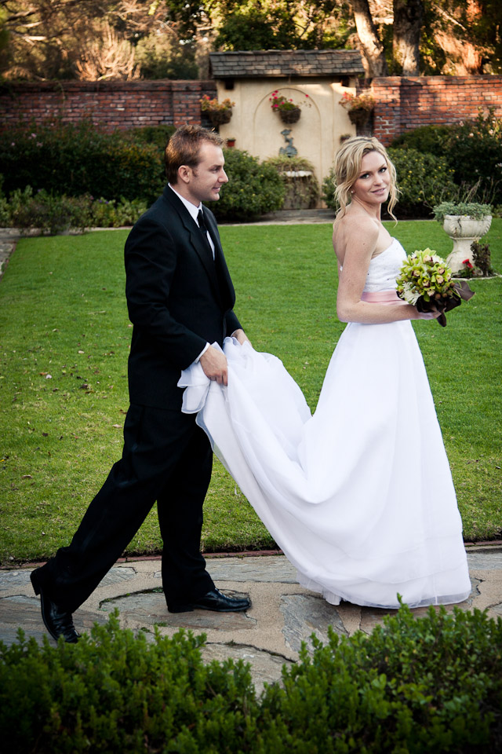
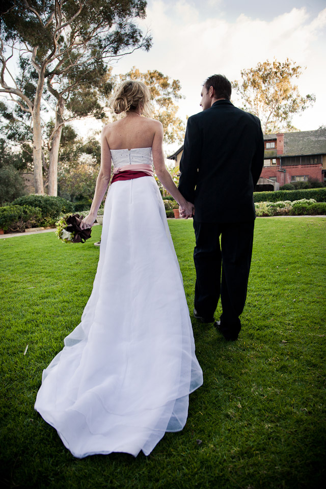
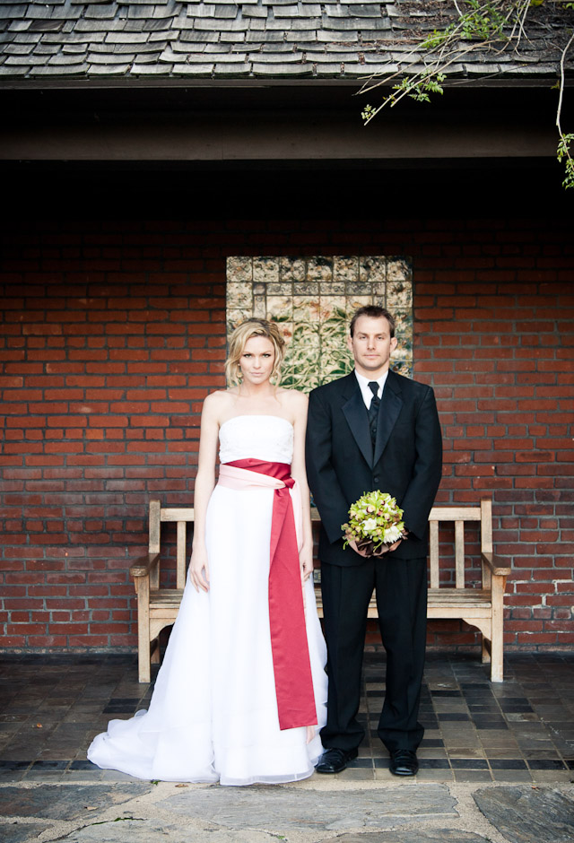
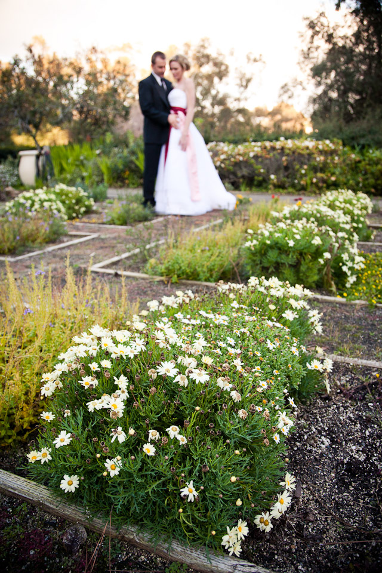

**FORMERLY "STARLET", THIS PROJECT WAS RENAMED TO STARMITE ON 10/2/2012**

Starmite
=======


Starmite is a small set of CSS classes and some javacript that allow you to create grid layouts that are fluid and each grid element is square and has no margin. 

Example: http://cdn.getbokeh.com/example.html

Usage
-----

Include the starmite CSS file along with jQuery and whatever else your page requires (Starmite works great with Bootstrap). There's also some Javascript that must be executed when your page loads (this will be moved to a plugin soon).

In your HTML, add the starmite-row class to each row and the appropriate class to your column cells:
``` html
<div class="starmite-row">
  <div class="starmite-sixth">
    <a href="http://github.com"></a>
  </div>
  <div class="starmite-sixth">
    
  </div>
  <div class="starmite-sixth">
    
  </div>
  <div class="starmite-sixth">
    
  </div>
  <div class="starmite-sixth">
    
  </div>
  <div class="starmite-sixth">
    
  </div>
</div>
```

Starmite uses percent widths to create its fluid grid. Because of this, the square format can only be achieved with Javascript. jQuery is required and the code below must be executed onload in order to achieve this. The code also resets the heights when the browser window is resized. This will eventually be refactored into a plugin. 
``` javascript
$(function(){
  makeSquares = function() {
    var rows = $('.starmite-row');
    rows.each(function() {
      var elements = $('[class^=starmite]', this);
      var firstWidth = elements.first().width();
      elements.height(firstWidth);  
    });
  }
  makeSquares();
  $(window).resize(makeSquares);
})
```

